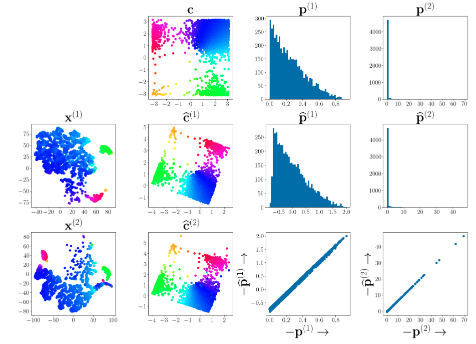

# Identifiable Shared Component Analysis of Unpaired Multimodal Mixtures



This repository contains the code to reproduce the experiments in the paper:  

[**"Identifiable Shared Component Analysis of Unpaired Multimodal Mixtures"**](https://openreview.net/pdf?id=ivCX2cjwcT)

## Citation

If you use this work, please cite the paper using the following BibTeX entry:

```bibtex
@article{timilsina2025identifiable,
  title={Identifiable Shared Component Analysis of Unpaired Multimodal Mixtures},
  author={Timilsina, Subash and Shrestha, Sagar and Fu, Xiao},
  journal={Advances in neural information processing systems},
  volume={37},
  year={2025}
}
```


## Prerequisites

1. **Install Dependencies**
   - Use the `requirements.txt` file to install the necessary Python packages:
     ```bash
     pip install -r requirements.txt
     ```

2. **Install Faiss-GPU (Optional)**
   - GPU users are recommended to install Faiss-GPU for faster nearest neighbors computation (word embedding alignment experiment):
     ```bash
     conda install faiss-gpu -c pytorch
     ```

---

## Steps to Reproduce Experiments

### 1. Synthetic Data Experiments

- **Shared Component Extraction**:
  Open the `synthetic_train.ipynb` notebook to validate **Theorems 1 and 3**.
  
- **Private Component Extraction**:
  Open the `private_extraction.ipynb` notebook to validate **Theorem 6**.

---

### 2. Real Data Experiments

#### A. Word Embedding Alignment

This experiment uses code adapted from [MUSE](https://github.com/facebookresearch/MUSE). Follow these steps:

1. Navigate to the `Word Alignment` folder and create a `data` directory:
   ```bash
   mkdir data
   cd data/
    ```
2. Download and extract pre-trained word vectors inside `data`:

    ```bash
    wget https://dl.fbaipublicfiles.com/arrival/vectors.tar.gz
    tar -xvf vectors.tar.gz
    ```

3. Prepare cross-lingual data:
    - Inside `data/`, create a `crosslingual` directory:
    ```bash
    mkdir crosslingual
    cd crosslingual
    ```

    - Download and extract the required files inside `crosslingual`:
    ```bash
    wget https://dl.fbaipublicfiles.com/arrival/wordsim.tar.gz
    wget https://dl.fbaipublicfiles.com/arrival/dictionaries.tar.gz
    tar -xvf wordsim.tar.gz
    tar -xvf dictionaries.tar.gz
    ```

4. Run the alignment script:
```bash
    bash run.sh
```


#### B. Domain Adaptation Experiments

This experiment uses utilities (`Domain Adaptation/utils/tllib/`) adapted from the [Transfer Learning Library](https://github.com/thuml/Transfer-Learning-Library). To reproduce the results:

1. Navigate to the `Domain Adaptation` folder.
2. Run the following scripts:
    - For Office-31 dataset:
        ```bash
        bash run_office31.sh
        ```
    - For Office-Home dataset:
        ```bash
        bash run_officehome.sh
        ```

#### C. Single-Cell Sequence Analysis
This experiment uses utilities (`Single cell sequence analysis/single_cell/`) adapted from the [Cross-modal autoencoders](https://github.com/uhlerlab/cross-modal-autoencoders). Follow these steps:

1. Navigate to the `Single cell sequence analysis` folder.
2. Run the script:
```bash
bash run.sh
```

