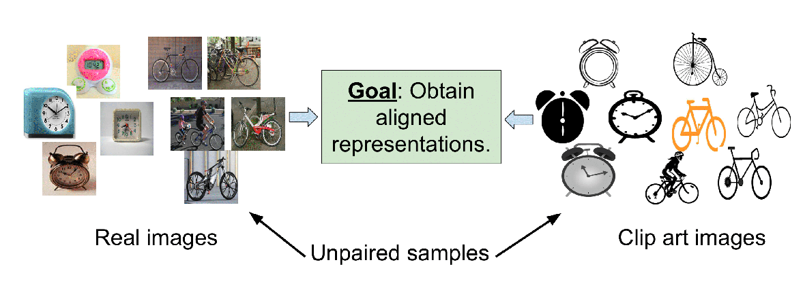
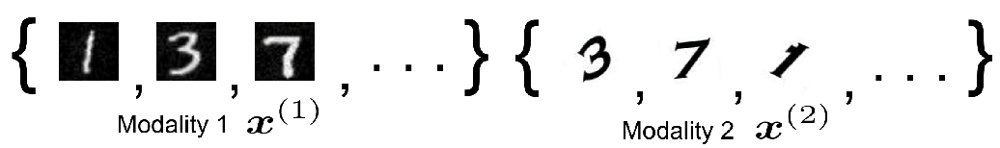
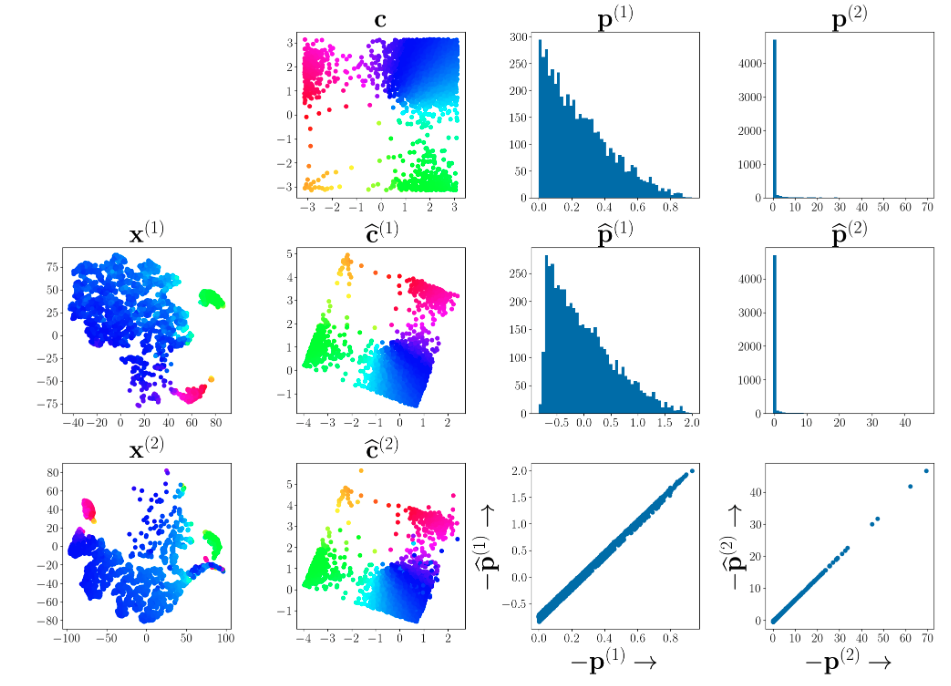
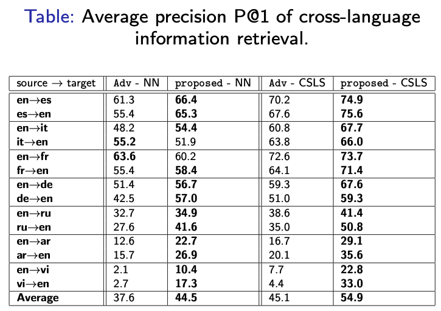
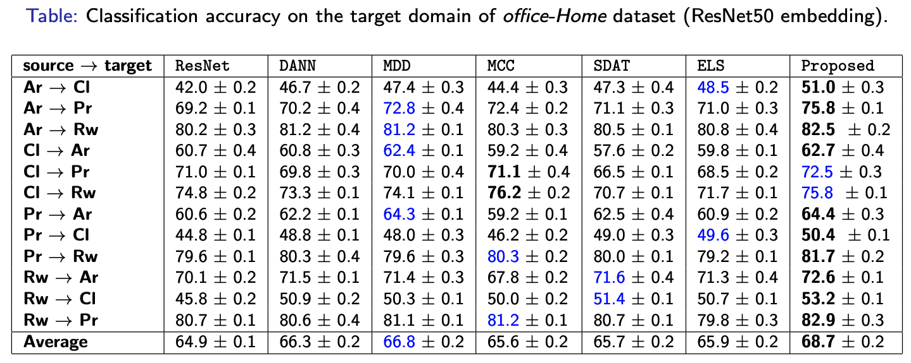
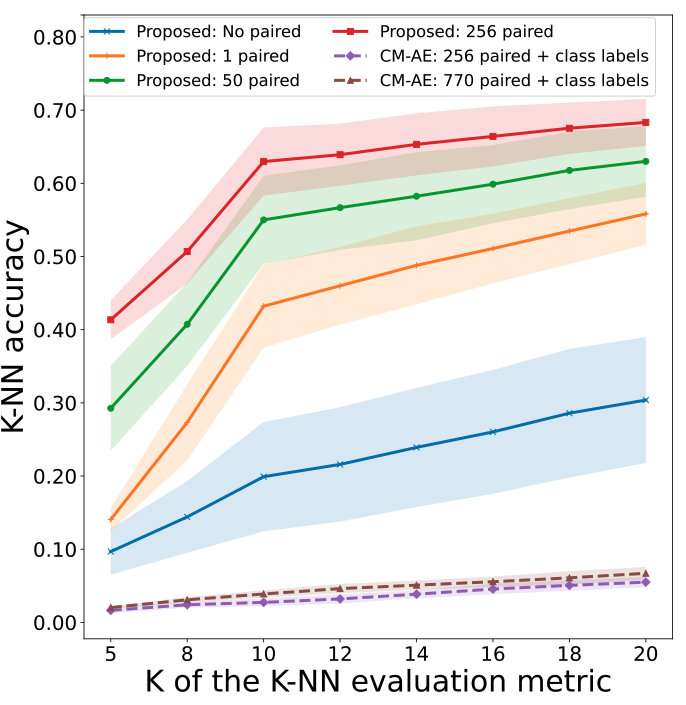

# Identifiable Shared Component Analysis of Unpaired Multimodal Mixtures

<p align="center">
  
</p>

<p align="center">
  <a href="https://openreview.net/pdf?id=ivCX2cjwcT"><b>Paper (OpenReview)</b></a>
  &nbsp;·&nbsp;
  <a href="https://neurips.cc/virtual/2024/poster/93984"><b>NeurIPS 2024 Page</b></a>
  &nbsp;·&nbsp;
  <a href="https://neurips.cc/media/neurips-2024/Slides/93984.pdf"><b>Slides</b></a>
</p>

Official code to reproduce the experiments in:

> **Identifiable Shared Component Analysis of Unpaired Multimodal Mixtures**
> Subash Timilsina, Sagar Shrestha, Xiao Fu
> *NeurIPS 2024*

---

## Table of Contents

- [Method Overview](#method-overview)
- [Prerequisites](#prerequisites)
- [Reproducing the Experiments](#reproducing-the-experiments)
  - [1. Synthetic Data](#1-synthetic-data)
  - [2. Word Embedding Alignment](#2-word-embedding-alignment)
  - [3. Domain Adaptation](#3-domain-adaptation)
  - [4. Single-Cell Sequence Analysis](#4-single-cell-sequence-analysis)
- [Citation](#citation)

---

## Method Overview

<p align="center">
  
</p>

Multimodal data of the same entity (e.g., text/audio/image) can be modeled as a
linear mixture of a **shared** component `c` and a modality-**private**
component `p^(q)`:

```
x^(q) = A^(q) z^(q),    z^(q) = [c; p^(q)],    q = 1, 2
```

Classical Canonical Correlation Analysis (CCA) provably recovers `c` *only when
cross-modality samples are paired*. In many real applications — cross-lingual
retrieval, domain adaptation, biological data translation — paired data is
expensive or unavailable.

**This work studies *Unaligned* Shared Component Analysis (SCA)** and proposes a
*distribution divergence minimization* loss:

```
find  Q^(q) ∈ R^{d_C × d^(q)},   q = 1, 2
s.t.  Q^(1) x^(1)  =(d)=  Q^(2) x^(2)              (matched distributions)
      Q^(q) E[x^(q) (x^(q))ᵀ] (Q^(q))ᵀ = I,         q = 1, 2
```

Empirically, the method is validated on synthetic data and three real-world
applications: cross-lingual word retrieval, image domain adaptation, and
single-cell sequence alignment.

---

## Prerequisites

**1. Install Python dependencies**

```bash
pip install -r requirements.txt
```

**2. (Optional) Install Faiss-GPU** for faster nearest-neighbor search in the
word-alignment experiment:

```bash
conda install faiss-gpu -c pytorch
```

All experiments were run on an **NVIDIA H100 GPU**.

---

## Reproducing the Experiments

### 1. Synthetic Data

Two notebooks validate the identifiability theorems on synthetic mixtures:

| Notebook | Validates |
|----------|-----------|
| [`Synthetic/synthetic_train.ipynb`](Synthetic/synthetic_train.ipynb) | **Theorems 1 & 3** — shared-component recovery |
| [`Synthetic/private_extraction.ipynb`](Synthetic/private_extraction.ipynb) | **Theorem 6** — private-component recovery |

**Result.**

<p align="center">
  
</p>

---

### 2. Word Embedding Alignment

Cross-lingual word retrieval, adapted from [MUSE](https://github.com/facebookresearch/MUSE).

**Step 1 — Download pretrained word vectors:**

```bash
cd "Word Alignment"
mkdir -p data && cd data
wget https://dl.fbaipublicfiles.com/arrival/vectors.tar.gz
tar -xvf vectors.tar.gz
```

**Step 2 — Download cross-lingual evaluation files:**

```bash
mkdir -p crosslingual && cd crosslingual
wget https://dl.fbaipublicfiles.com/arrival/wordsim.tar.gz
wget https://dl.fbaipublicfiles.com/arrival/dictionaries.tar.gz
tar -xvf wordsim.tar.gz
tar -xvf dictionaries.tar.gz
```

**Step 3 — Run alignment:**

```bash
cd "../.."   # back to Word Alignment/
bash run.sh
```

**Result.**

<p align="center">
  
</p>

---

### 3. Domain Adaptation

Image domain adaptation using ResNet-50 embeddings; utilities adapted from the
[Transfer Learning Library](https://github.com/thuml/Transfer-Learning-Library).

```bash
cd "Domain Adaptation"

bash run_office31.sh        # Office-31 benchmark
bash run_officehome.sh      # Office-Home benchmark
```

**Result.**

<p align="center">
  
</p>

---

### 4. Single-Cell Sequence Analysis

Cross-modal alignment of single-cell data, adapted from
[Cross-modal autoencoders](https://github.com/uhlerlab/cross-modal-autoencoders).

```bash
cd "Single cell sequence analysis"
bash run.sh
```

**Result.**

<p align="center">
  
</p>

---

## Citation

If you use this work, please cite:

```bibtex
@article{timilsina2025identifiable,
  title={Identifiable Shared Component Analysis of Unpaired Multimodal Mixtures},
  author={Timilsina, Subash and Shrestha, Sagar and Fu, Xiao},
  journal={Advances in Neural Information Processing Systems},
  volume={37},
  year={2025}
}
```
